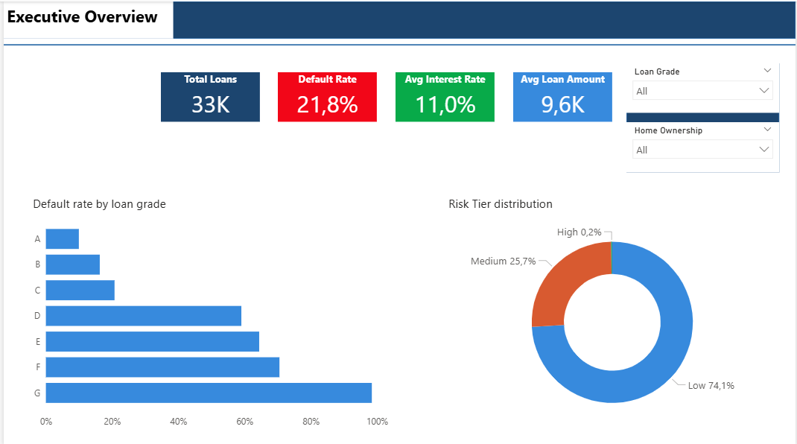
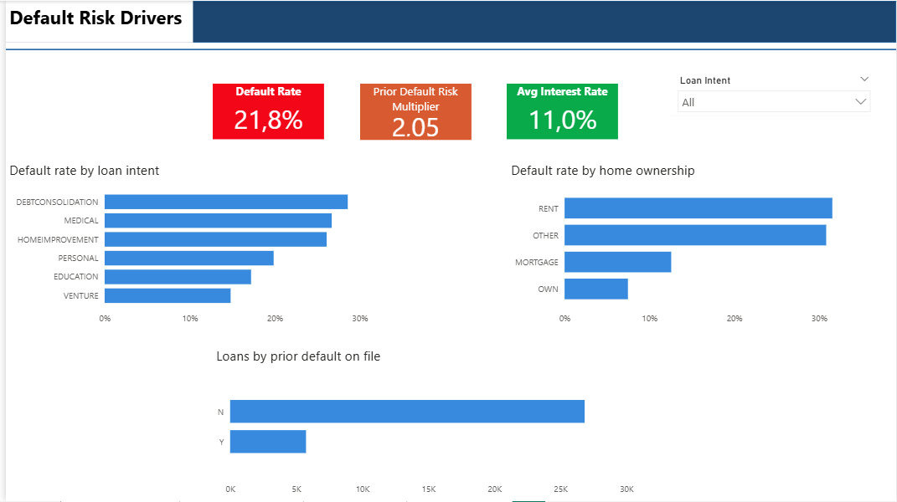
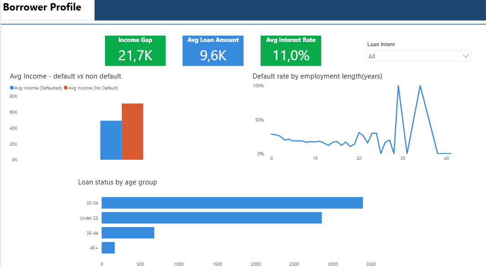
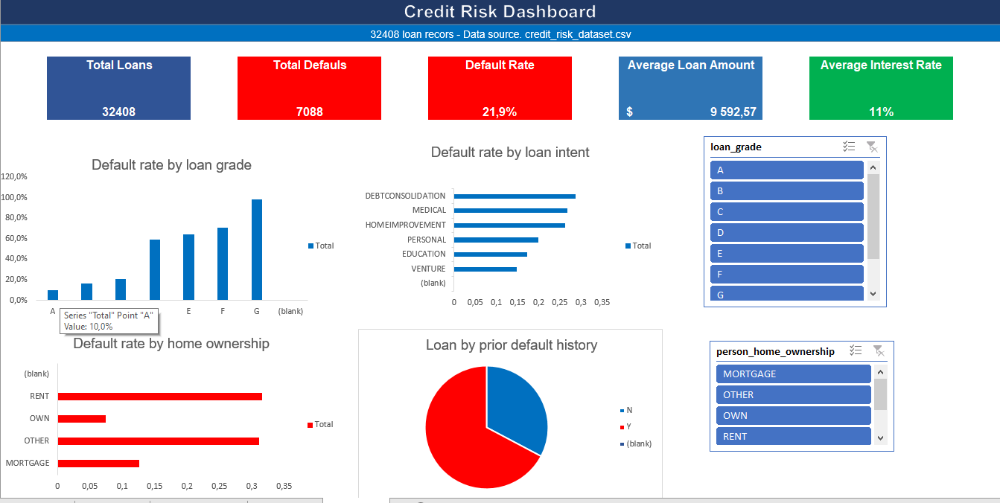

# 💳 Credit Risk Analysis — End-to-End Data Analytics Project


## 📌 Project Overview

This is a full end-to-end data analytics project analysing 32,581 loan records to identify the key drivers of credit default risk. The project follows a real-world analytics workflow — from raw data exploration in SQL, through data cleaning and formula-driven analysis in Excel, to an interactive Power BI dashboard — demonstrating the complete skill set expected of a junior to mid-level data analyst.

---

## 🗂️ Repository Structure

credit-risk-analysis/

├── README.md

├── data/

│   └── credit_risk_dataset.csv

├── sql/

│   ├── credit_risk_schema.sql        ← Database setup, table, view & stored procedure

│   └── credit_risk_analysis.sql      ← All 10 analytical queries

├── excel/

│   └── credit_risk_analysis.xlsx     ← Cleaned data, pivot tables & dashboard

├── powerbi/

│   └── credit_risk_dashboard.pbix    ← Interactive 4-page Power BI report

└── screenshots/

├── overview_page.png

├── default_drivers.png

├── borrower_profile.png

└── excel_dashboard.png

---

## 🛠️ Tools & Technologies

| Tool | Version | Purpose |
|---|---|---|
| MySQL | 8.0+ | Database design, SQL querying, views, stored procedures |
| MySQL Workbench | 8.0+ | Query editor and schema visualisation |
| Microsoft Excel | 2019 / 365 | Data cleaning, formula analysis, pivot tables, dashboard |
| Power BI Desktop | Latest | Interactive dashboard, DAX measures, slicers |
| GitHub | — | Version control and portfolio publishing |

---

## 📊 Dataset

| Property | Detail |
|---|---|
| Rows | 32,581 loan records |
| Columns | 12 |
| Source | Public credit risk dataset (Kaggle) |
| Target variable | `loan_status` (0 = No Default, 1 = Default) |
| Missing values | 3,116 nulls in `loan_int_rate`, 895 nulls in `person_emp_length` |
| Duplicate rows | 165 |

### Column Reference

| Column | Type | Description |
|---|---|---|
| `person_age` | Integer | Borrower age in years |
| `person_income` | Integer | Annual income in USD |
| `person_home_ownership` | Text | RENT / MORTGAGE / OWN / OTHER |
| `person_emp_length` | Float | Years of employment |
| `loan_intent` | Text | Purpose of the loan (6 categories) |
| `loan_grade` | Text | Lender-assigned credit grade (A–G) |
| `loan_amnt` | Integer | Loan amount requested (USD) |
| `loan_int_rate` | Float | Annual interest rate (%) |
| `loan_status` | Integer | Target variable — 0 = No Default, 1 = Default |
| `loan_percent_income` | Float | Loan amount as a percentage of annual income |
| `cb_person_default_on_file` | Text | Whether borrower has a prior default on record (Y / N) |
| `cb_person_cred_hist_length` | Integer | Length of credit history in years |

---

## ❓ Business Questions

This project was designed to answer 7 core business questions:

1. Which loan grades have the highest default rates, and how does interest rate vary by grade?
2. What is the overall default rate and how does it differ by loan intent category?
3. Does home ownership status correlate with likelihood of default?
4. How does the loan-to-income ratio differ between defaulters and non-defaulters?
5. Does having a prior default on the credit bureau file increase current default risk?
6. What is the income profile of borrowers who default vs those who do not?
7. Which combination of loan grade and home ownership produces the highest risk segment?

---

## 🗄️ Phase 1 — MySQL

### What Was Done
- Designed and created the `credit_risk_db` database schema
- Loaded all 32,581 raw rows directly from CSV — including nulls and duplicates — to document data quality issues using SQL
- Used `NULLIF()` in the `LOAD DATA INFILE` statement to correctly convert empty CSV fields into true SQL NULLs
- Wrote 10 analytical queries covering aggregations, filtering, grouping, CASE WHEN bands, and window functions
- Created a reusable `VIEW` (`vw_loan_grade_summary`) summarising default rate and cost by grade
- Created a parameterised `STORED PROCEDURE` (`sp_intent_report`) for on-demand loan intent reporting

### SQL Files

**`credit_risk_schema.sql`** — run this first:
- `CREATE DATABASE` and `CREATE TABLE` with correct data types
- `LOAD DATA INFILE` import script with `NULLIF()` handling for blank fields
- `CREATE VIEW vw_loan_grade_summary`
- `CREATE PROCEDURE sp_intent_report`

**`credit_risk_analysis.sql`** — run this second:
- Query 1: Dataset overview and overall default rate, including a null count check
- Query 2: Default rate by loan grade with `RANK()` window function
- Query 3: Default rate by loan intent
- Query 4: Default rate by home ownership status
- Query 5: Income comparison — defaulters vs non-defaulters
- Query 6: Prior default (credit bureau) impact on current default rate
- Query 7: Loan-to-income ratio banding using `CASE WHEN`
- Query 8: Loan grade vs home ownership risk matrix (cross-tab)
- Query 9: Age group analysis
- Query 10: Window function comparing each borrower's loan amount to their grade average

### Sample Query — Prior Default Impact
```sql
SELECT
    cb_person_default_on_file                         AS prior_default,
    COUNT(*)                                           AS total_borrowers,
    SUM(loan_status)                                   AS current_defaults,
    ROUND(SUM(loan_status) * 100.0 / COUNT(*), 1)      AS default_rate_pct
FROM loans
GROUP BY cb_person_default_on_file;
```

---

## 📗 Phase 2 — Excel

### What Was Done
- Removed 165 duplicate rows, bringing the dataset to 32,416 clean records
- Removed 7 rows with impossible age values (>80) and 2 rows with an impossible 123-year employment length
- Filled 3,116 nulls in `loan_int_rate` and 895 nulls in `person_emp_length` using the median value
- Added 4 derived columns using nested `IF` formulas: `age_group`, `lti_band`, `risk_tier`, `default_label`
- Built a `Summary_Metrics` sheet with KPI formulas: `AVERAGEIF`, `COUNTIFS`, `MAXIFS`, `XLOOKUP`
- Created 5 PivotTables: default rate by grade, default rate by intent, income by default status, ownership risk, prior default impact
- Built 6 charts and assembled a final `Dashboard` tab with KPI boxes and slicers

### Key Formulas Used

```excel
-- Average interest rate, skipping blank cells
=AVERAGEIF(loans_data[loan_int_rate],"<>",loans_data[loan_int_rate])

-- Average income for defaulters only
=AVERAGEIF(loans_data[loan_status],1,loans_data[person_income])

-- Grade G borrowers who defaulted
=COUNTIFS(loans_data[loan_grade],"G",loans_data[loan_status],1)

-- Largest loan amount issued at Grade G
=MAXIFS(loans_data[loan_amnt], loans_data[loan_grade], "G")
```

---

## 📊 Phase 3 — Power BI

### What Was Done
- Connected Power BI to the cleaned Excel workbook
- Applied Power Query (M) transformations: removed duplicates and outliers, filled nulls, added `Age_Group`, `Risk_Tier` and `LTI_Band` custom columns
- Created 13 DAX measures covering default rates, income comparisons, prior-default risk multipliers, and ranking
- Built a 4-page interactive report with slicers synced across all pages
- Published to Power BI Service for a shareable live link

### DAX Measures

```dax
Default Rate % =
    DIVIDE([Total Defaults], [Total Loans], 0)

Prior Default Risk Multiplier =
    DIVIDE([Default Rate (Prior Default = Y)], [Default Rate (Prior Default = N)], 0)

Income Gap =
    [Avg Income (No Default)] - [Avg Income (Defaulted)]

Grade Default Rank =
    RANKX(ALL(loans[loan_grade]), CALCULATE([Default Rate %]),, DESC, DENSE)
```

### Report Pages

| Page | Focus | Key Visuals |
|---|---|---|
| 1 — Executive Overview | KPIs & risk summary | 4 cards, risk tier donut, default rate by grade bar chart |
| 2 — Default Risk Drivers | Default rate by intent, ownership, prior default | 3 bar charts, prior default risk multiplier card |
| 3 — Borrower Profile | Income and demographic comparison | Income comparison column chart, scatter plot, age group breakdown |
| 4 — Loan Economics | Interest rate and loan amount by grade | Combo chart, matrix table, risk tier slicer |

🔗 **[View Live Power BI Dashboard](#)** ← *(replace with your published link)*

---

## 💡 Key Findings

| # | Finding | Supporting Data |
|---|---|---|
| 1 | **Grade G loans default at a near-total rate** | 98.4% of Grade G borrowers defaulted, compared to just 10.0% for Grade A |
| 2 | **Prior default more than doubles current risk** | Borrowers with a prior default on file: 37.8% default rate vs 18.4% for those without |
| 3 | **Renters default at 4x the rate of homeowners** | RENT: 31.6% default rate vs OWN: 7.5%, MORTGAGE: 12.6% |
| 4 | **Defaulters earn significantly less** | Avg income $49,126 (defaulted) vs $70,804 (no default) — a $21,678 gap |
| 5 | **Debt consolidation loans carry the highest intent-based risk** | 28.6% default rate, the highest of all 6 loan intent categories |
| 6 | **Interest rate rises sharply with credit grade** | Grade A averages 7.33% vs Grade G at 20.25% — a 177% increase |
| 7 | **Data quality issues were meaningful, not trivial** | 3,116 null interest rates (9.6% of records), 165 duplicates, and 7 impossible age values required active cleaning |

---

## 🚀 How to Run This Project

### MySQL Setup
```bash
# 1. Open MySQL Workbench and connect to your local server
# 2. Run the schema file to create the database, table, view and procedure:
source sql/credit_risk_schema.sql

# 3. Run the analysis queries:
source sql/credit_risk_analysis.sql
```

### Excel
1. Open `excel/credit_risk_analysis.xlsx`
2. Navigate to the **Dashboard** tab for the summary view
3. Use the Loan Grade and Home Ownership slicers to filter all charts simultaneously

### Power BI
1. Open `powerbi/credit_risk_dashboard.pbix` in Power BI Desktop
2. If prompted, update the data source path to your local file location
3. Use the slicers on each page to filter by Loan Grade, Risk Tier, Home Ownership, or Prior Default status

---

## 📁 Screenshots

### Overview


### Default Risk Drivers



### Borrower Profile


### Excel Dashboard


---

## 👤 Author

**[Sifiso Mngomezulu]**
📧 [your.email@example.com]
🔗 [LinkedIn Profile URL]
💼 [Portfolio URL]

---

## 📄 License

This project uses a publicly available dataset for educational and portfolio purposes.
